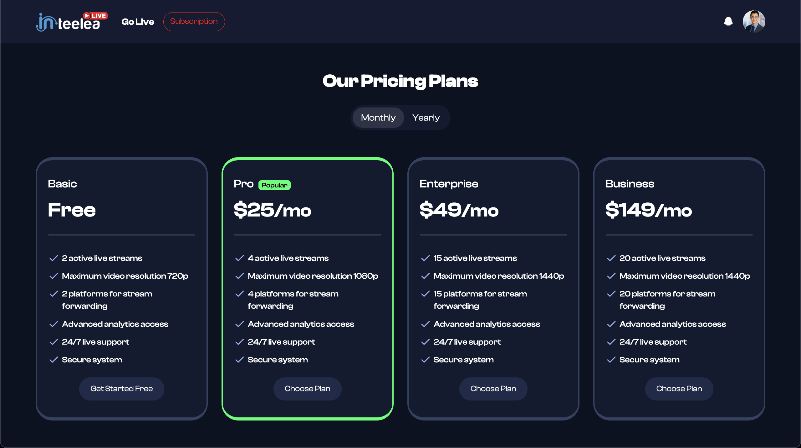
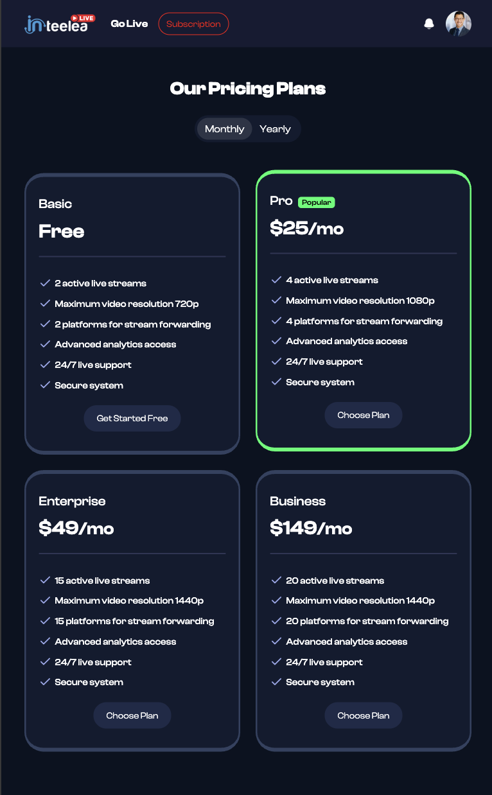
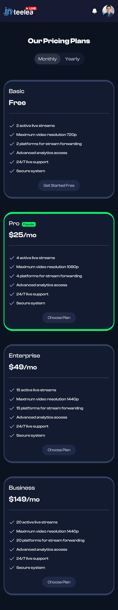

# Bitquintet Frontend Development Task

## Overview

This project is a responsive HTML page built based on the provided Figma design.  
I used **Bootstrap 5** for layout and responsiveness, along with **custom CSS** where necessary to match the design closely.

The focus was on writing clean, semantic HTML5 and CSS3, ensuring full responsiveness across desktop, tablet, and mobile devices.

## Live Demo

The project is also hosted online.  
You can view it here: [Live Website Link](https://kaziarman23.github.io/bitquintet-task)

## Screenshots

### Desktop View



### Tablet View



### Mobile View



_(Note: Please view the `/screenshots` folder for full-size images.)_

## Technologies Used

- **HTML5**
- **CSS3**
- **Bootstrap 5**

## How to Run the Project

1. Clone the repository:
   ```bash
   git clone https://github.com/kaziarman23/bitquintet-tast.git
   ```
2. Open the `index.html` file directly in your browser.

No additional installation or setup is required.

## Key Highlights

- Fully responsive across all major devices.
- Carefully matched margins, paddings, font sizes, and other design elements to the Figma reference.
- Organized code structure for easy readability and maintenance.
- No JavaScript used, as per requirements.

## Folder Structure

```
/project-root
│
├── /public
│   └── (Assets used in the page)
│
├── /screenshots
│   └── desktop.png
│   └── tablet.png
│   └── mobile.png
│
├── index.html
├── style.css
└── README.md
```

## Final Notes

I have put careful attention into ensuring the layout and styling match the design as accurately as possible.  
The page was tested across different screen sizes to ensure responsiveness and a consistent user experience.

---

✅ *Project completed by [Kazi Arman](https://github.com/kaziarman23)*✨
